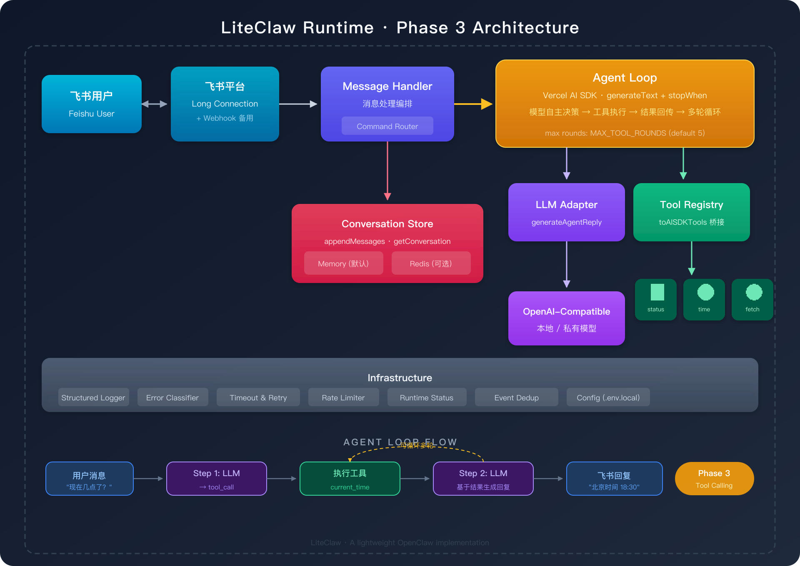

# LiteClaw

[](https://github.com/WarrenJones/liteClaw)
[](https://www.typescriptlang.org/)
[](https://nodejs.org/)
[](https://open.feishu.cn/)
[](https://platform.openai.com/docs)

> 一步步用 TypeScript 构建一个轻量版 OpenClaw Agent —— 从最小链路到完整工具调用。

> Build a lightweight OpenClaw agent step by step in TypeScript — from minimal chat to full tool-calling capabilities.

---

## 这个项目是什么

LiteClaw 是一个面向学习和实践的 Agent 项目。它不是对 OpenClaw 的完整复刻，而是一个**可以跟着做的、从零到一的 Agent 构建教程**：

1. **Phase 1** — 先打通最短链路：飞书消息 → 本地模型 → 回复
2. **Phase 2** — 补齐基础设施：持久化、日志、错误处理、限流
3. **Phase 3** — 实现 Agent 核心：模型自主调用工具 + 多轮 Agent Loop ← **当前已完成**

每个 Phase 都是可运行的，你可以从任意阶段开始理解和实验。

---

## 架构总览

<p align="center">
  
</p>

上图展示了 Phase 3 完成后的完整架构，包括：

- **飞书接入层**：长连接（默认）+ Webhook 备用
- **消息处理编排**：Command Router 处理命令，普通消息进入 Agent Loop
- **Agent Loop**：Vercel AI SDK 的 `generateText` + `stopWhen` 自动管理多轮工具调用
- **Tool Registry**：`toAISDKTools` 桥接层将 LiteClaw 工具转换为 AI SDK 格式
- **Conversation Store**：Memory / Redis 可切换，支持完整消息序列（含 tool calls）
- **Infrastructure**：日志、错误分类、超时重试、限流等基础设施

---

## 当前能力

### 已实现

- **飞书接入**：长连接模式（无需公网域名）+ webhook 备用
- **模型调用**：任意 OpenAI-compatible 本地/私有模型
- **Agent Loop**：模型自主选择工具 → 执行 → 结果回传 → 多轮循环
- **3 个内置工具**：
  - `local_status` — 查看运行时状态
  - `current_time` — 获取当前时间（支持时区）
  - `http_fetch` — 受控 HTTP GET（支持域名白名单）
- **会话管理**：按 chat_id 维护上下文，支持 Memory / Redis 切换
- **命令路由**：`/help`、`/reset`、`/status`、`/tools`
- **基础设施**：结构化日志、错误分类、超时重试、限流、事件去重

### 暂未覆盖

- 长期记忆与摘要
- 卡片消息 / 文件处理 / 流式回复
- 多步任务编排
- 飞书加密事件解密

---

## 快速开始

### 1. 环境要求

- Node.js `20+`
- `pnpm`
- 已开通机器人和事件订阅的飞书应用
- 一个本地或私有部署的 OpenAI-compatible 模型服务（**需支持 function calling**）

### 2. 安装依赖

```bash
pnpm install
```

### 3. 创建本地配置

```bash
cp .env.example .env.local
```

将你自己的本地配置写入 `.env.local`，不要提交该文件。

核心配置项：

```bash
# 飞书
FEISHU_APP_ID=your-feishu-app-id
FEISHU_APP_SECRET=your-feishu-app-secret
FEISHU_CONNECTION_MODE=long-connection

# 模型（需支持 function calling）
MODEL_BASE_URL=http://localhost:8000/v1
MODEL_API_KEY=your-local-model-api-key
MODEL_ID=your-model-id

# Agent Loop
MAX_TOOL_ROUNDS=5                    # 单次对话最大工具调用轮次
TOOL_EXECUTION_TIMEOUT_MS=10000      # 单个工具执行超时
HTTP_FETCH_ALLOWED_DOMAINS=          # http_fetch 域名白名单（空=允许所有）

# 存储（默认内存，可选 Redis）
STORAGE_BACKEND=memory
# STORAGE_BACKEND=redis
# REDIS_URL=redis://127.0.0.1:6379
```

完整配置说明见 `.env.example`。

### 4. 启动服务

```bash
pnpm dev
```

### 5. 验证

在飞书中给机器人发消息：

- **"现在几点了？"** → 模型调用 `current_time` 工具，返回当前时间
- **"/status"** → 查看运行时状态
- **"/tools"** → 查看已注册工具列表
- **"/help"** → 查看帮助

---

## 飞书接入

LiteClaw 默认使用飞书长连接模式，本地开发无需公网域名或 tunnel。

基本步骤：

1. 在飞书开放平台创建企业自建应用
2. 为应用开启机器人能力
3. 开启事件订阅，选择长连接模式
4. 订阅 `im.message.receive_v1`
5. 发布应用并开始本地联调

详细配置见 [飞书配置指南](docs/feishu-config.md)。

---

## 模型要求

Phase 3 的 Agent Loop 依赖模型的 **function calling / tool calling** 能力。以下模型已验证或理论兼容：

- **Qwen 2.5+**（推荐）
- **DeepSeek V3 / R1**
- **LLaMA 3.1+**（需要支持 tool use 的版本）
- 任何支持 OpenAI function calling 协议的模型

如果你的模型不支持 function calling，LiteClaw 仍可正常作为普通聊天机器人运行（工具不会被调用）。

---

## 添加自定义工具

只需 3 步：

**1. 创建工具文件** `src/services/tools/my-tool.ts`

```typescript
import { z } from "zod";
import type { LiteClawTool } from "../tools.js";

export const myTool: LiteClawTool = {
  name: "my_tool",
  description: "给模型看的工具描述",
  parameters: z.object({
    query: z.string().describe("参数描述")
  }),
  async run(context) {
    const query = context.arguments?.query as string;
    // ... 你的逻辑
    return { text: "工具返回结果" };
  }
};
```

**2. 注册到 registry** — 在 `src/services/tools.ts` 中导入并添加到 `toolRegistry`

**3. 完成** — 模型会自动发现并使用新工具

---

## 目录结构

```
src/
├── index.ts                         # 启动入口
├── config.ts                        # 配置管理（.env.local）
├── routes/
│   └── feishu.ts                    # Webhook 路由
├── types/
│   └── feishu.ts                    # 飞书事件类型定义
└── services/
    ├── feishu.ts                    # 飞书长连接 & API 客户端
    ├── feishu-message-handler.ts    # 消息处理编排（Agent Loop 入口）
    ├── llm.ts                       # LLM 适配器（generateAgentReply）
    ├── commands.ts                  # 命令路由
    ├── tools.ts                     # Tool Registry + AI SDK 桥接
    ├── tools/
    │   ├── local-status.ts          # 内置工具：运行时状态
    │   ├── current-time.ts          # 内置工具：当前时间
    │   └── http-fetch.ts            # 内置工具：受控 HTTP 请求
    ├── store.ts                     # Store 接口定义
    ├── conversation-store.ts        # Store 后端选择器
    ├── memory.ts                    # 内存 Store 实现
    ├── redis-store.ts               # Redis Store 实现
    ├── runtime-status.ts            # 运行时状态快照
    ├── logger.ts                    # 结构化 JSON 日志
    ├── errors.ts                    # 错误分类系统
    ├── resilience.ts                # 超时 & 重试
    └── rate-limit.ts                # 滑动窗口限流
docs/
├── phase3-tool-calling.md           # Phase 3 技术方案
├── phases-implementation-guide.md   # 各阶段实现说明
├── liteclaw-feishu-mvp.md           # MVP 技术方案
├── feishu-config.md                 # 飞书配置指南
└── github-publish-checklist.md      # 发布检查清单
```

---

## 演进路线

### Phase 1：最小可运行链路 ✅

飞书消息接入 → 本地模型调用 → 会话上下文 → 事件去重

### Phase 2：Agent 基础能力 ✅

Redis 持久化 → 结构化日志 → 错误分类 → 超时重试 → 限流 → 命令路由

### Phase 3：工具调用 + Agent Loop ✅ ← 当前

Tool Registry → 模型自主选工具 → 多轮 Agent Loop → 3 个内置工具

### Phase 4：记忆与状态管理

短期/长期记忆分层 → 摘要机制 → 记忆裁剪

### Phase 5：任务执行与编排

多步任务拆解 → 状态机 → 进度反馈

### Phase 6：向 OpenClaw 能力对齐

完整 Agent 编排 → 工具生态 → 权限审计 → 丰富消息形式

---

## 文档

- [路线图](ROADMAP.md)
- [Phase 1 技术方案 — 最小可运行链路](docs/phase1-minimal-chain.md)
- [Phase 2 技术方案 — Agent 基础设施](docs/phase2-infrastructure.md)
- [Phase 3 技术方案 — 工具调用](docs/phase3-tool-calling.md)
- [阶段实现说明](docs/phases-implementation-guide.md)
- [MVP 技术方案](docs/liteclaw-feishu-mvp.md)
- [飞书配置指南](docs/feishu-config.md)
- [GitHub 发布检查清单](docs/github-publish-checklist.md)
- [贡献指南](CONTRIBUTING.md)

---

## 安全说明

- 真实凭据仅放在 `.env.local` 中
- 不要提交模型服务地址、密钥或任何内网信息
- `.gitignore` 已忽略 `.env.local`、`.env`、`.npmrc`、`dist` 和 `node_modules`
- `http_fetch` 工具支持域名白名单（`HTTP_FETCH_ALLOWED_DOMAINS`），生产环境建议开启
