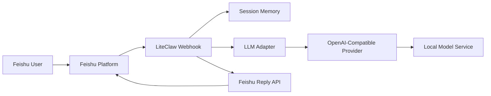

# LiteClaw

LiteClaw is a lightweight TypeScript service that connects Feishu conversations to any local OpenAI-compatible model.

It is designed as a minimal, production-minded starting point for teams that want to build a private chat assistant with a simple architecture, clear extension points, and local model control.

## Overview

LiteClaw focuses on one clean request path:

`Feishu message -> LiteClaw webhook -> local model -> Feishu reply`

The project keeps the first version intentionally small:

- TypeScript end to end
- Feishu event subscription webhook
- OpenAI-compatible model adapter
- short-term in-memory conversation context
- duplicate event protection
- minimal operational surface

## Highlights

- Built with `TypeScript`, `Node.js`, and `Hono`
- Works with any local OpenAI-compatible model endpoint
- Supports Feishu `url_verification` and message event handling
- Maintains per-chat conversation history in memory
- Includes simple reset commands: `/reset` and `重置会话`
- Keeps credentials and model configuration local via `.env.local`

## Architecture



## Current Scope

What is included:

- `GET /healthz` health check
- `POST /feishu/webhook` inbound webhook
- Feishu URL verification handling
- text message parsing
- per-`chat_id` conversation memory
- duplicate event detection based on `event_id`
- local model integration through AI SDK

What is not included yet:

- persistent storage
- encrypted Feishu event payloads
- message cards
- tool calling
- file processing
- streaming responses

## Quick Start

### 1. Prerequisites

- Node.js `20+`
- `pnpm`
- A Feishu app with bot and event subscription enabled
- A local or private OpenAI-compatible model endpoint
- A public callback URL for Feishu during integration testing

### 2. Install dependencies

```bash
pnpm install
```

### 3. Create local configuration

```bash
cp .env.example .env.local
```

Fill in `.env.local` with your own local values. Do not commit this file.

Example variables:

```bash
PORT=3000
HOST=0.0.0.0

FEISHU_APP_ID=your-feishu-app-id
FEISHU_APP_SECRET=your-feishu-app-secret
FEISHU_VERIFICATION_TOKEN=your-feishu-verification-token
FEISHU_ENCRYPT_KEY=

MODEL_BASE_URL=http://localhost:8000/v1
MODEL_API_KEY=your-local-model-api-key
MODEL_ID=your-model-id

SYSTEM_PROMPT=You are LiteClaw, a concise and reliable assistant.
SESSION_MAX_TURNS=10
EVENT_DEDUPE_TTL_MS=600000
```

### 4. Start the service

```bash
pnpm dev
```

Default local address:

```txt
http://0.0.0.0:3000
```

## Feishu Setup

To connect LiteClaw to Feishu:

1. Create a self-built app in Feishu Open Platform.
2. Enable bot capability.
3. Enable event subscription.
4. Point the callback URL to:

```txt
https://your-domain.example.com/feishu/webhook
```

For local development, expose your local server through a tunnel such as `cloudflared`.

## Local Verification

Health check:

```bash
curl http://127.0.0.1:3000/healthz
```

Feishu URL verification:

```bash
curl -X POST http://127.0.0.1:3000/feishu/webhook \
  -H 'content-type: application/json' \
  -d '{"type":"url_verification","challenge":"abc123","token":"YOUR_TOKEN"}'
```

Expected response:

```json
{"challenge":"abc123"}
```

## Project Structure

```txt
src/
  config.ts
  index.ts
  routes/feishu.ts
  services/feishu.ts
  services/llm.ts
  services/memory.ts
  types/feishu.ts
docs/
  github-publish-checklist.md
  liteclaw-feishu-mvp.md
```

## Security Notes

- Keep real credentials in `.env.local` only.
- Do not commit provider-specific endpoints, secrets, or internal network addresses.
- `.gitignore` already excludes `.env.local`, `.env`, `.npmrc`, `dist`, and `node_modules`.
- This repository intentionally keeps deployment-specific model settings out of the tracked files.

## Roadmap

- Redis-backed session persistence
- group mention filtering
- better logging and observability
- richer error handling
- command routing
- optional tool execution

## Documentation

- [Technical plan](docs/liteclaw-feishu-mvp.md)
- [GitHub publish checklist](docs/github-publish-checklist.md)
