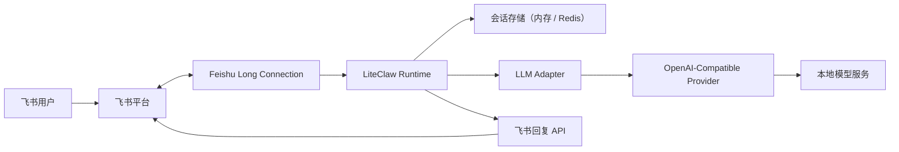

# LiteClaw

[](https://github.com/WarrenJones/liteClaw)
[](https://www.typescriptlang.org/)
[](https://nodejs.org/)
[](https://open.feishu.cn/)
[](https://platform.openai.com/docs)

> 一个用 TypeScript 构建的 OpenClaw 轻量版本，从最小链路开始，逐步演进到完整 Agent 能力。

> A lightweight TypeScript implementation of OpenClaw, evolving from a minimal chat workflow toward full agent capabilities.

LiteClaw 是一个面向 OpenClaw 的轻量版本实现，使用 TypeScript 从零搭建，并以可渐进演化的方式逐步补齐 OpenClaw 的核心能力。

它不是对 OpenClaw 的完整复刻，而是一个更容易理解、更容易扩展、也更适合作为工程起点的最小实现：先从飞书消息接入、本地模型调用和基础会话能力开始，再逐步演进到工具调用、记忆、任务执行等更完整的 Agent 能力。

当前默认采用飞书长连接模式接收事件，本地开发无需公网域名或内网穿透，更接近 OpenClaw 的接入方式。

## 快速导航

- [项目简介](#项目简介)
- [快速开始](#快速开始)
- [飞书接入](#飞书接入)
- [演进路线](#演进路线)
- [详细路线图](ROADMAP.md)
- [贡献指南](CONTRIBUTING.md)
- [技术方案](docs/liteclaw-feishu-mvp.md)
- [飞书配置指南](docs/feishu-config.md)

## 项目简介

LiteClaw 当前先聚焦一条尽可能短的请求链路：

`飞书长连接 -> LiteClaw -> 本地模型 -> 飞书回复`

第一版刻意保持精简，但目标不是停留在一个简单 chatbot，而是作为 OpenClaw 能力的分阶段落地版本：

- 全链路 TypeScript
- 基于飞书官方长连接模式的接入
- 基于 OpenAI-compatible 协议的模型适配层
- 可切换的会话存储，默认内存、可选 Redis
- 基于 `event_id` 的重复事件保护
- 尽量小的部署和运维成本

## 特性

- 基于 `TypeScript`、`Node.js` 和 `Hono`
- 可接入任意本地 OpenAI-compatible 模型服务
- 默认支持飞书长连接消息事件处理，并兼容 webhook 回退模式
- 支持按会话维度维护上下文
- 内置基础命令路由：`/help`、`/reset` 和未知命令提示
- 通过 `.env.local` 管理本地配置，避免敏感信息进入仓库

## 架构概览



## 当前能力范围

当前已实现：

- `GET /healthz` 健康检查
- 飞书长连接接收消息事件
- `POST /feishu/webhook` webhook 兼容回退入口
- 飞书 URL 校验（仅 webhook 模式）
- 文本消息解析
- 按 `chat_id` 的会话上下文维护
- 可选 Redis 会话持久化
- 按 `event_id` 的事件去重
- 群聊仅在 `@机器人` 时响应
- 基础命令路由：`/help`、`/reset`
- 结构化 JSON 日志与基础错误分类
- 通过 AI SDK 接入本地模型

当前已验证：

- 群聊文本消息可以进入 LiteClaw
- LiteClaw 可以成功调用 OpenAI-compatible 模型
- 模型返回后可以调用飞书发送消息接口完成回复

当前暂未覆盖：

- 长期记忆与摘要
- 飞书加密事件解密
- 卡片消息
- 工具调用
- 文件处理
- 流式回复

## 快速开始

### 1. 环境要求

- Node.js `20+`
- `pnpm`
- 已开通机器人和事件订阅的飞书应用
- 一个本地或私有部署的 OpenAI-compatible 模型服务
- 如果使用 webhook 回退模式，才需要公网回调地址

### 2. 安装依赖

```bash
pnpm install
```

### 3. 创建本地配置

```bash
cp .env.example .env.local
```

将你自己的本地配置写入 `.env.local`，不要提交该文件。

示例：

```bash
PORT=3000
HOST=0.0.0.0
LOG_LEVEL=info

FEISHU_CONNECTION_MODE=long-connection
FEISHU_DOMAIN=feishu
FEISHU_APP_ID=your-feishu-app-id
FEISHU_APP_SECRET=your-feishu-app-secret
FEISHU_VERIFICATION_TOKEN=
FEISHU_ENCRYPT_KEY=

MODEL_BASE_URL=http://localhost:8000/v1
MODEL_API_KEY=your-local-model-api-key
MODEL_ID=your-model-id

SYSTEM_PROMPT=你是 LiteClaw，一个简洁可靠的助手。
STORAGE_BACKEND=memory
REDIS_URL=redis://127.0.0.1:6379
REDIS_KEY_PREFIX=liteclaw
SESSION_MAX_TURNS=10
SESSION_TTL_SECONDS=604800
EVENT_DEDUPE_TTL_MS=600000
```

如果你要启用 Redis 持久化，把下面两项改掉即可：

```bash
STORAGE_BACKEND=redis
REDIS_URL=redis://127.0.0.1:6379
```

### 4. 启动服务

```bash
pnpm dev
```

默认监听地址：

```txt
http://0.0.0.0:3000
```

## 飞书接入

LiteClaw 当前默认使用飞书长连接模式，这意味着：

- 本地开发无需公网域名
- 无需配置 tunnel
- 更接近 OpenClaw 的飞书接入方式

当前更推荐的本地联调网络方式是：

- 外网走手机热点或稳定外网
- 公司内网能力通过 VPN 保留

如果你的飞书连接需要外网，而模型只在公司内网可访问，这种组合通常比本地代理更稳。

将 LiteClaw 接入飞书的基本步骤：

1. 在飞书开放平台创建企业自建应用。
2. 为应用开启机器人能力。
3. 开启事件订阅。
4. 选择长连接模式接收事件。
5. 订阅 `im.message.receive_v1`。
6. 发布应用并开始本地联调。

如果你明确想使用公网 webhook，也可以切回：

```bash
FEISHU_CONNECTION_MODE=webhook
```

详细配置见：

- [飞书配置指南](docs/feishu-config.md)

## 本地验证

健康检查：

```bash
curl http://127.0.0.1:3000/healthz
```

你可以重点关注返回里的 `storage.backend` 和 `storage.ready`，确认当前是否真的跑在 Redis 后端上。

Webhook 回退模式下的 URL 校验：

```bash
curl -X POST http://127.0.0.1:3000/feishu/webhook \
  -H 'content-type: application/json' \
  -d '{"type":"url_verification","challenge":"abc123","token":"YOUR_TOKEN"}'
```

预期返回：

```json
{"challenge":"abc123"}
```

默认长连接模式下，更直接的验证方式是：

1. 本地执行 `pnpm dev`
2. 确认日志里出现 `bootstrap.feishu_long_connection_initialized`
3. 确认后续出现 `feishu.sdk`，且 `message` 包含 `[ws] ws client ready`
4. 在飞书里给机器人发一条文本消息

如果你想确认是否真的走到了模型层，可以关注这些日志：

- `feishu.message.received`
- `feishu.message.command_handled`
- `feishu.message.model_request_prepared`
- `llm.request.started`
- `llm.request.completed`
- `feishu.message.reply_sending`

如果你想看更详细的结构化日志，可以在 `.env.local` 中设置：

```bash
LOG_LEVEL=debug
```

## 目录结构

```txt
src/
  config.ts
  services/commands.ts
  services/conversation-store.ts
  services/errors.ts
  index.ts
  services/logger.ts
  routes/feishu.ts
  services/feishu.ts
  services/feishu-message-handler.ts
  services/llm.ts
  services/memory.ts
  services/redis-store.ts
  services/store.ts
  types/feishu.ts
docs/
  github-publish-checklist.md
  liteclaw-feishu-mvp.md
```

## 安全说明

- 真实凭据仅放在 `.env.local` 中。
- 不要提交模型服务地址、密钥或任何内网信息。
- `.gitignore` 已忽略 `.env.local`、`.env`、`.npmrc`、`dist` 和 `node_modules`。
- 仓库中的示例配置均为占位内容，不包含真实部署信息。

## 演进路线

### Phase 1：最小可运行链路

- 飞书消息接入
- 本地模型调用
- 会话上下文维护
- 事件去重与基础稳定性

### Phase 2：Agent 基础能力

- Redis 会话持久化与可替换 store
- 结构化日志与错误分类
- 命令路由扩展

### Phase 3：向 OpenClaw 能力对齐

- 工具调用
- 任务执行
- 更完整的记忆机制
- 更丰富的消息交互形式
- 可扩展的 Agent 编排能力

## 文档

- [路线图](ROADMAP.md)
- [技术方案](docs/liteclaw-feishu-mvp.md)
- [飞书配置指南](docs/feishu-config.md)
- [GitHub 发布检查清单](docs/github-publish-checklist.md)
- [贡献指南](CONTRIBUTING.md)
