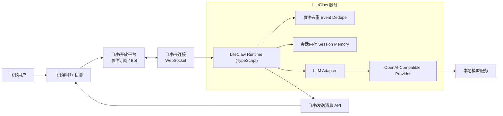
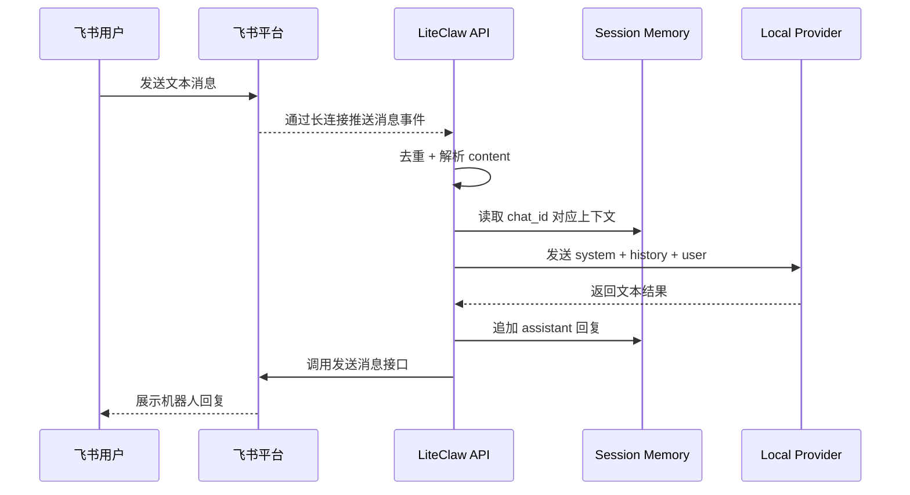
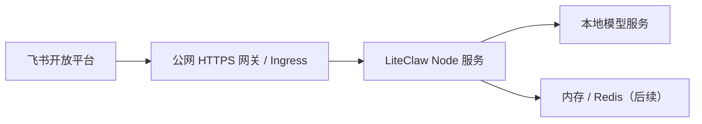

# LiteClaw 技术方案（OpenClaw 轻量版本）

## 1. 目标

构建一个最小可用版本的 `liteClaw`，把它作为 OpenClaw 的轻量版本起点，让用户可以在飞书里给机器人发消息，并通过本地 OpenAI-compatible 模型生成回复。

这个项目的核心目标不是一次性复刻完整 OpenClaw，而是先落地最小可运行链路，再按阶段逐步补齐 OpenClaw 所代表的核心能力，例如工具调用、记忆、任务执行和更完整的 Agent 编排。当前默认采用飞书长连接模式接收事件，避免为了本地联调引入公网 webhook。

方案目标：

- 前后端统一使用 TypeScript，避免引入 Python。
- 优先打通最短链路：`飞书长连接 -> LiteClaw -> 本地模型 -> 飞书回复`。
- 支持最基础的多轮上下文。
- 方案保持可扩展，后续可逐步接入工具调用、记忆、任务执行，逐步向 OpenClaw 能力对齐。

非目标（MVP 不做）：

- 不做完整 OpenClaw Agent 编排。
- 不做复杂权限系统。
- 不做数据库持久化记忆。
- 不做多模态上传处理。
- 不做完整运维平台。

---

## 2. 总体架构



---

## 3. 时序图



---

## 4. 技术选型

推荐技术栈：

- Runtime: `Node.js 20+`
- Language: `TypeScript`
- HTTP 框架: `Hono`
- 模型调用: `ai` + `@ai-sdk/openai-compatible`
- 本地开发运行: `tsx`
- 配置管理: `.env.local`
- 日志: `pino` 或先用 `console`
- 临时存储: 进程内 `Map`
- 飞书接入: 官方长连接模式

为什么这样选：

- 你熟悉 TypeScript，上手最快。
- Hono 轻量，适合作为本地 runtime 和 healthz 入口。
- OpenAI-compatible 方式可以连接本地模型服务。
- 先用内存会话，最快跑通 MVP；以后再切 Redis 或 DB。

---

## 5. 模块拆分

建议目录：

```txt
liteClaw/
  docs/
    liteclaw-feishu-mvp.md
  src/
    index.ts           # Hono 入口
    routes/feishu.ts   # webhook 兼容路由
    services/feishu.ts # 飞书长连接 / 发消息 / 验签
    services/feishu-message-handler.ts # 飞书消息事件处理
    services/llm.ts    # 本地模型 provider 封装
    services/memory.ts # 会话上下文与事件去重
    types/feishu.ts    # 飞书事件类型
    config.ts          # 环境变量读取
  package.json
  tsconfig.json
  .env.example
```

---

## 6. 关键数据流

### 6.1 飞书到 LiteClaw

输入来源：

- 飞书私聊消息
- 飞书群聊 @机器人 消息

进入服务后处理顺序：

1. 飞书通过长连接把消息事件推到 LiteClaw
2. 校验事件类型是否为消息事件
3. 校验是否已处理过该 `event_id`
4. 从 `content` 中提取文本
5. 读取 `chat_id` 对应上下文
6. 调用模型生成回复
7. 回复飞书

### 6.2 LiteClaw 到模型

调用方式：

- 通过 OpenAI-compatible 接口调用本地模型
- 具体模型名、地址和密钥只保存在本地 `.env.local`
- 文档和仓库中只保留通用占位，不保留真实配置

### 6.3 LiteClaw 到飞书

回复方式：

- 使用飞书发送消息接口
- 发送纯文本消息即可
- MVP 阶段不做卡片消息

---

## 7. 配置设计

建议把真实配置放在本地 `.env.local`，不要提交到仓库。

推荐变量：

```bash
PORT=3000
HOST=0.0.0.0

FEISHU_APP_ID=your-feishu-app-id
FEISHU_APP_SECRET=your-feishu-app-secret
FEISHU_CONNECTION_MODE=long-connection
FEISHU_DOMAIN=feishu
FEISHU_VERIFICATION_TOKEN=
FEISHU_ENCRYPT_KEY=

MODEL_BASE_URL=http://localhost:8000/v1
MODEL_API_KEY=your-local-model-api-key
MODEL_ID=your-model-id

SYSTEM_PROMPT=你是 liteClaw，一个简洁可靠的中文助手。
SESSION_MAX_TURNS=10
EVENT_DEDUPE_TTL_MS=600000
```

说明：

- `.env.example` 只保留占位内容。
- 默认推荐使用 `FEISHU_CONNECTION_MODE=long-connection`。
- `.env.local` 已加入 `.gitignore`。
- 如果飞书没开启加密，可以先不处理 `FEISHU_ENCRYPT_KEY`。

---

## 8. 代码层设计

### 8.1 LLM Adapter

职责：

- 把业务层消息转成 AI SDK 的消息格式
- 统一模型配置
- 统一 system prompt

伪代码：

```ts
import { createOpenAICompatible } from "@ai-sdk/openai-compatible";
import { generateText } from "ai";

const provider = createOpenAICompatible({
  name: "local-openai-compatible",
  baseURL: process.env.MODEL_BASE_URL!,
  apiKey: process.env.MODEL_API_KEY!,
});

export async function chat(messages: Array<{ role: "user" | "assistant"; content: string }>) {
  const result = await generateText({
    model: provider(process.env.MODEL_ID!),
    system: process.env.SYSTEM_PROMPT,
    messages,
  });

  return result.text;
}
```

### 8.2 Session Memory

MVP 用内存结构即可：

```ts
type ChatMessage = {
  role: "user" | "assistant";
  content: string;
};

const sessionStore = new Map<string, ChatMessage[]>();
const eventDedupeStore = new Map<string, number>();
```

---

## 9. 接口设计

### 9.1 入站能力

默认模式：

- 飞书长连接 `WebSocket`

兼容模式：

- `POST /feishu/webhook`

处理两类请求：

- `url_verification`
- `event_callback`

### 9.2 出站接口

服务端调用飞书：

- 获取 `tenant_access_token`
- 调用发送消息接口

### 9.3 健康检查

`GET /healthz`

返回：

```json
{ "ok": true }
```

---

## 10. 安全与稳定性

MVP 至少做这几项：

- 校验飞书请求来源签名或 verification token
- 做 `event_id` 去重
- 限制单次上下文长度
- 限制单次输出长度
- 对模型超时做兜底提示
- 记录请求日志和错误日志

---

## 11. 部署方案

### 11.1 本地开发

推荐方式：

1. 本地启动 Node 服务：`http://localhost:3000`
2. 使用飞书长连接模式直接联调
3. 如果飞书需要外网、模型需要内网，优先使用“热点 + 公司 VPN”

### 11.2 内网 / 线上部署

部署位置建议：

- 一台可以访问本地模型服务的 Node 服务
- 如果继续使用长连接模式，不需要额外暴露公网 webhook 域名

推荐拓扑：



---

## 12. MVP 实施分阶段

### Phase 1：打通最小链路

目标：

- 飞书能发消息给机器人
- 机器人能调用本地模型回复

交付：

- `GET /healthz`
- 飞书长连接接入
- `POST /feishu/webhook` webhook 兼容入口
- 飞书文本收发
- 内存多轮上下文

### Phase 2：增强可用性

目标：

- 降低重复回复和异常率

交付：

- `event_id` 去重
- 日志
- 超时控制
- 错误兜底
- 群聊 @ 识别

### Phase 3：逐步向 OpenClaw 能力演进

目标：

- 从聊天机器人升级为最小 Agent

交付：

- 命令路由，例如 `/help` `/reset`
- 简单工具调用，例如查询文档、调用内部 API
- Redis 会话持久化
- Prompt 模板化

---

## 13. 结论

最推荐的落地方式是：

`飞书应用机器人 + TypeScript Node 长连接服务 + OpenAI-compatible 本地模型 + 内存会话`

这是一条开发成本最低、最符合你技术背景、同时又能保留后续扩展空间的方案。
