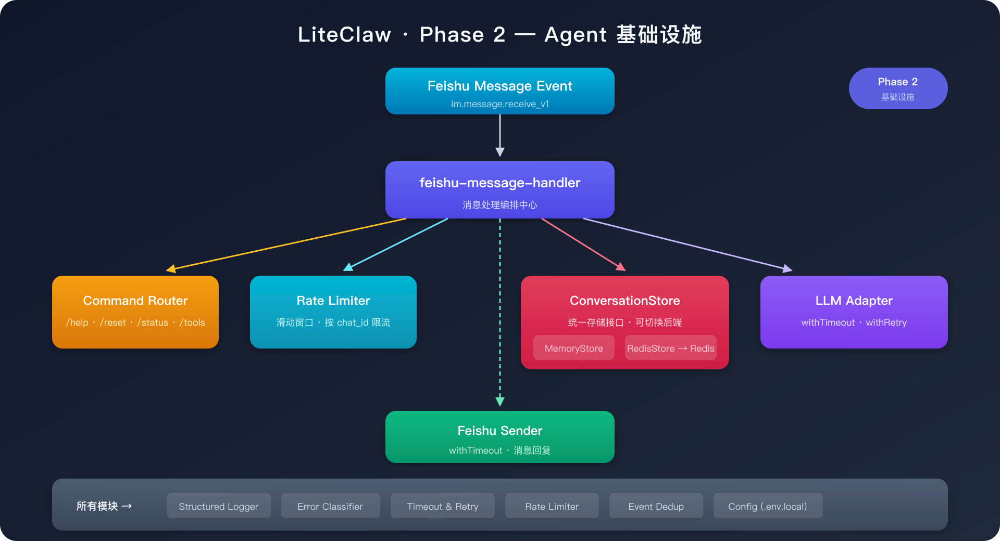

# Phase 2：Agent 基础设施

## 1. 目标

把系统从"能跑的 demo"升级成"可以持续迭代的服务底座"。

Phase 2 完成后，LiteClaw 将具备：

- **持久化存储**：Redis 会话存储，跨重启保留对话上下文
- **可切换后端**：统一 Store 接口，Memory / Redis 随时切换
- **结构化日志**：单行 JSON 格式，固定事件名，便于检索和告警
- **错误分类**：统一错误码 + 分类（upstream / internal / validation），区分可重试与不可重试
- **稳定性治理**：超时控制、有限重试、滑动窗口限流
- **命令路由**：`/help`、`/reset`、`/status`、`/tools`，命令优先于限流执行

---

## 2. 与 OpenClaw 的对齐

一个真正可用的 Agent 不只是"能回复消息"，还需要：

- **可靠性**：不丢消息、不重复回复、超时有兜底
- **可观测性**：出了问题能快速定位
- **可扩展性**：存储、模型、工具都可以替换

LiteClaw Phase 2 就是在补齐这些 Agent 基础设施。这些能力在 OpenClaw 中同样是核心基建。

---

## 3. 实施步骤

| 步骤 | 内容 | 关键文件 | 状态 |
|------|------|----------|------|
| 2a | Store 接口抽象 + Redis 实现 | `store.ts`, `redis-store.ts`, `conversation-store.ts` | ✅ |
| 2b | 结构化日志 | `logger.ts` | ✅ |
| 2c | 错误分类系统 | `errors.ts` | ✅ |
| 2d | 超时与重试 | `resilience.ts` | ✅ |
| 2e | 滑动窗口限流 | `rate-limit.ts` | ✅ |
| 2f | 命令路由 | `commands.ts` | ✅ |
| 2g | 运行时状态快照 | `runtime-status.ts` | ✅ |

---

## 4. 关键链路架构

### 4.1 整体架构（Phase 2）

<p align="center">
  
</p>

### 4.2 Store 抽象设计

核心思路不是"把业务代码直接改成 Redis 版"，而是先做一层统一接口：

```typescript
// src/services/store.ts
interface ConversationStore {
  initialize(): Promise<void>;
  getConversation(chatId: string): Promise<ConversationMessage[]>;
  appendExchange(chatId: string, userText: string, assistantText: string): Promise<void>;
  resetConversation(chatId: string): Promise<void>;
  tryStartEvent(eventId: string): Promise<boolean>;
  markEventDone(eventId: string): Promise<void>;
  markEventFailed(eventId: string): Promise<void>;
}
```

消息处理逻辑只依赖接口，不关心底层到底是进程内 Map 还是 Redis。

#### MemoryStore

默认实现，适合本地快速启动：

- 进程内 `Map` 存储
- 重启后丢失
- 零配置启动

#### RedisStore

用于跨进程 / 跨重启保留近期会话：

- Redis list 存储会话消息
- `LTRIM` 裁剪到最近 N 条
- `SESSION_TTL_SECONDS` 设置过期时间
- `SET NX PX` 实现事件去重

---

## 5. 稳定性层

### 5.1 结构化日志

```typescript
// src/services/logger.ts
// 单行 JSON，固定 event 名
{ "event": "message.received", "chatId": "xxx", "ts": "..." }
{ "event": "llm.call.completed", "chatId": "xxx", "duration": 1200 }
```

关键设计：
- 每条日志有固定的 `event` 名（如 `message.received`、`llm.call.failed`）
- 结构化字段便于 grep / 聚合
- `LOG_LEVEL` 控制输出级别

### 5.2 错误分类

```typescript
// src/services/errors.ts
class LiteClawError extends Error {
  code: string;           // "llm_timeout" | "feishu_send_failed" | ...
  category: string;       // "upstream" | "internal" | "validation"
  retryable: boolean;     // 是否值得重试
  details?: Record<string, unknown>;
}
```

错误分为三类：
- **upstream**：外部依赖失败（模型超时、飞书 API 错误）
- **internal**：内部逻辑错误
- **validation**：输入校验失败

### 5.3 超时与重试

```typescript
// src/services/resilience.ts
withTimeout(fn, { operation, timeoutMs, category })
withRetry(fn, { operation, maxRetries, delayMs })
```

策略：
- 模型调用：超时 + 有限重试
- 飞书发送：仅超时，不自动重试（避免重复回复）
- Redis 操作：超时保护

### 5.4 滑动窗口限流

```typescript
// src/services/rate-limit.ts
// 按 chat_id 做滑动窗口限流
// 命令路由优先于限流执行
// 只有真正进入模型链路的普通消息触发限流检查
```

---

## 6. 命令路由

| 命令 | 功能 | 说明 |
|------|------|------|
| `/help` | 显示帮助信息 | 列出所有可用命令 |
| `/reset` | 重置当前会话 | 清空 chat_id 对应的上下文 |
| `/status` | 查看运行时状态 | 调用 `local_status` 工具 |
| `/tools` | 查看已注册工具 | 列出 tool registry 中所有工具 |

设计要点：
- 命令以 `/` 开头
- 命令优先于限流执行（不消耗限流配额）
- `/status` 通过 tool registry 执行，复用工具体系

---

## 7. 配置项

Phase 2 新增配置：

```env
# 存储后端
STORAGE_BACKEND=memory            # memory | redis
REDIS_URL=redis://127.0.0.1:6379
REDIS_KEY_PREFIX=liteclaw
SESSION_TTL_SECONDS=604800        # 会话过期时间（默认 7 天）

# 稳定性
LLM_TIMEOUT_MS=30000              # 模型调用超时
LLM_MAX_RETRIES=1                 # 模型重试次数
LLM_RETRY_DELAY_MS=500            # 重试间隔
FEISHU_REQUEST_TIMEOUT_MS=10000   # 飞书请求超时
STORAGE_OPERATION_TIMEOUT_MS=5000 # 存储操作超时

# 限流
RATE_LIMIT_MAX_MESSAGES=5         # 窗口内最大消息数
RATE_LIMIT_WINDOW_MS=10000        # 滑动窗口大小

# 日志
LOG_LEVEL=info                    # info | debug
```

---

## 8. 关键模块

| 模块 | 文件 | 职责 |
|------|------|------|
| Store 接口 | `src/services/store.ts` | 统一存储接口定义 |
| Store 选择器 | `src/services/conversation-store.ts` | 根据配置创建对应后端 |
| 内存实现 | `src/services/memory.ts` | 进程内 Map 存储 |
| Redis 实现 | `src/services/redis-store.ts` | Redis 持久化存储 |
| 结构化日志 | `src/services/logger.ts` | 单行 JSON 日志 |
| 错误分类 | `src/services/errors.ts` | 统一错误码 + 分类 |
| 超时与重试 | `src/services/resilience.ts` | `withTimeout` / `withRetry` |
| 限流 | `src/services/rate-limit.ts` | 滑动窗口限流器 |
| 命令路由 | `src/services/commands.ts` | 命令解析与分发 |
| 运行时状态 | `src/services/runtime-status.ts` | `/status` 状态快照 |

---

## 9. 完成标准

- [x] Redis Store 实现并可正常读写
- [x] Memory / Redis 可通过配置切换
- [x] 结构化日志输出 JSON 格式
- [x] 错误分类覆盖所有关键路径
- [x] 模型调用有超时和重试保护
- [x] 飞书发送有超时保护
- [x] 滑动窗口限流正常工作
- [x] `/help`、`/reset`、`/status`、`/tools` 命令可用
- [x] 命令优先于限流执行

---

## 10. 风险与注意事项

1. **Redis 可选**：Phase 2 的 Redis 不是强依赖。`STORAGE_BACKEND=memory` 依然是默认值，本地开发可以不装 Redis
2. **限流粒度**：当前按 `chat_id` 限流，不区分用户。群聊场景下所有人共享同一个窗口
3. **日志量**：`LOG_LEVEL=debug` 会输出大量日志，生产环境建议 `info`
4. **重试策略**：仅对模型调用做重试，飞书发送不重试（避免重复回复）
