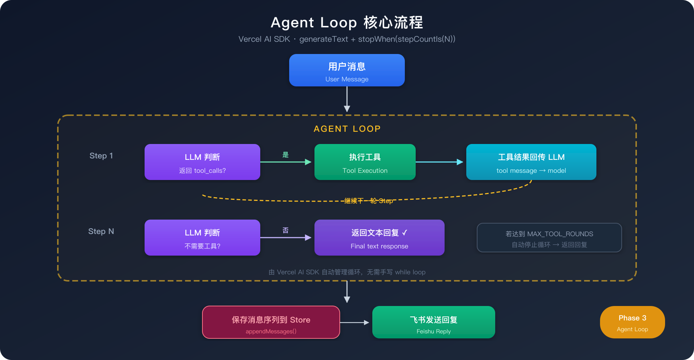

# Phase 3：工具调用（Tool Calling）

## 1. 目标

让 LiteClaw 从"只会回复文本"升级到"能执行受控动作"——这是 Agent 最核心的能力跃迁。

Phase 3 完成后，LiteClaw 将具备：

- **模型自主选择工具**：LLM 通过 function calling 协议决定是否调用工具、调用哪个
- **工具执行 + 结果回传**：工具执行结果作为 tool message 回传 LLM，LLM 基于结果生成最终回复
- **多轮工具调用**：支持单次对话中连续调用多个工具（最多 `MAX_TOOL_ROUNDS` 轮）
- **可扩展的工具体系**：新增工具只需定义接口、注册即可

---

## 2. 与 OpenClaw 的对齐

OpenClaw 的核心 Agent Loop 就是：

1. 用户输入 → 模型判断是否需要工具
2. 如果需要 → 返回 `tool_calls`，runtime 执行工具
3. 工具结果 → 作为 `tool` 消息回传模型
4. 模型基于工具结果生成最终回复
5. 如果模型再次返回 `tool_calls`，重复 2-4

LiteClaw Phase 3 实现了这个循环的完整版本，并借助 Vercel AI SDK 的 `stopWhen` 机制自动管理多轮循环。

---

## 3. 实施步骤

| 步骤 | 内容 | 关键变更 | 状态 |
|------|------|----------|------|
| 3a | Tool 接口加入 Zod parameters，Store 扩展 tool 消息 | `tools.ts`, `store.ts`, `memory.ts`, `redis-store.ts` | ✅ |
| 3b | LLM 层支持 tool calling + Agent Loop | `llm.ts`（新增 `generateAgentReply`） | ✅ |
| 3c | Message Handler 集成 Agent Loop | `feishu-message-handler.ts` | ✅ |
| 3d | 3 个工具：`local_status`、`current_time`、`http_fetch` | `tools/` | ✅ |

---

## 4. 关键链路架构

### 4.1 整体架构（Phase 3）

<p align="center">
  
</p>

### 4.2 Agent Loop 核心流程

<p align="center">
  
</p>

### 4.3 消息序列示例

一次典型的工具调用会产生以下消息序列：

```typescript
messages = [
  // 对话历史
  { role: "user",      content: "现在几点了？" },

  // --- Step 1: LLM 返回 tool_calls ---
  { role: "assistant", content: "",
    toolCalls: [{ id: "call_1", name: "current_time", arguments: {} }]
  },

  // --- Runtime 执行工具，结果回传 ---
  { role: "tool", toolCallId: "call_1", toolName: "current_time",
    content: "当前时间（Asia/Shanghai）：2026/03/17 18:30:00"
  },

  // --- Step 2: LLM 基于工具结果回复 ---
  { role: "assistant", content: "现在是北京时间 18:30。" }
]
```

### 4.4 Tool 接口设计

```typescript
// LiteClawTool —— 每个工具的定义
type LiteClawTool = {
  name: string;                    // 工具唯一标识
  description: string;             // 给模型看的描述
  parameters: z.ZodTypeAny;       // Zod schema，定义输入参数
  run(ctx: ToolExecutionContext): Promise<ToolExecutionResult>;
};

// ToolExecutionContext —— 工具执行上下文
type ToolExecutionContext = {
  chatId: string;
  eventId: string;
  trigger: "command" | "model";   // 命令触发 or 模型自主调用
  arguments?: Record<string, unknown>; // 模型传入的参数
  userText: string;
};

// ToolExecutionResult —— 工具返回
type ToolExecutionResult = {
  text: string;                   // 回传给模型的文本结果
  metadata?: Record<string, unknown>;
};
```

### 4.5 ConversationMessage 类型

```typescript
type ConversationMessage =
  | { role: "user"; content: string }
  | { role: "assistant"; content: string }
  | { role: "assistant"; content: string; toolCalls: ToolCallRecord[] }
  | { role: "tool"; toolCallId: string; toolName: string; content: string };

type ToolCallRecord = {
  id: string;
  name: string;
  arguments: Record<string, unknown>;
};
```

### 4.6 AI SDK 桥接层

`toAISDKTools()` 将 LiteClaw tool registry 转换为 Vercel AI SDK 的 `ToolSet` 格式：

```typescript
// tools.ts
export function toAISDKTools(context): ToolSet {
  // 遍历 toolRegistry，每个工具的 run() → SDK 的 execute
  // parameters (Zod schema) → inputSchema
}
```

---

## 5. 已实现的工具

| 工具 | 用途 | 参数 | 状态 |
|------|------|------|------|
| `local_status` | 查看运行时状态 | 无参数 | ✅ |
| `current_time` | 获取当前时间 | `timezone?`（可选，默认 Asia/Shanghai） | ✅ |
| `http_fetch` | 受控 HTTP GET 请求 | `url`（必填），内置域名白名单 | ✅ |
| `weather` | 查询城市天气 | `city`（必填），和风天气 API | ✅ |
| `code_exec` | 执行代码片段 | `code`（必填），`language?`（js/shell） | ✅ |
| `feishu_doc_search` | 搜索飞书文档 | `query`（必填） | ✅ |

---

## 6. 配置项

新增环境变量：

```env
# Agent Loop
MAX_TOOL_ROUNDS=5                    # 单次对话最大工具调用轮次（默认 5）
TOOL_EXECUTION_TIMEOUT_MS=10000      # 单个工具执行超时（默认 10s）
HTTP_FETCH_ALLOWED_DOMAINS=          # http_fetch 域名白名单，逗号分隔（空=允许所有）

# 天气工具（和风天气）
QWEATHER_API_KEY=                    # 和风天气 API Key（为空则不注册 weather 工具）
QWEATHER_BASE_URL=https://devapi.qweather.com  # 和风天气 API 地址

# 代码执行
CODE_EXEC_ENABLED=false              # 是否启用代码执行工具（默认关闭）
CODE_EXEC_TIMEOUT_MS=5000            # 代码执行超时（默认 5s）

# 飞书文档搜索
FEISHU_DOC_SEARCH_ENABLED=false      # 是否启用飞书文档搜索（默认关闭）
```

---

## 7. 日志事件

新增结构化日志事件：

| 事件名 | 时机 |
|--------|------|
| `agent.loop.started` | 进入 Agent Loop |
| `agent.loop.round_completed` | 一轮 step 结束（含 tool calls 列表） |
| `agent.loop.completed` | 整个 loop 结束，含 stepCount 和 toolCallCount |
| `agent.loop.max_rounds_exceeded` | 超过最大轮次上限 |
| `tool.execution.started` | 单个工具开始执行 |
| `tool.execution.completed` | 单个工具执行完成 |
| `tool.execution.failed` | 单个工具执行失败 |

---

## 8. 完成标准

- [x] Tool 接口包含 `parameters` Zod Schema
- [x] LLM 调用支持传入 tools 并解析 tool_calls（`generateAgentReply`）
- [x] Agent Loop 能完成多轮 用户→工具调用→结果回传→最终回复
- [x] Conversation Store 支持 tool 角色消息的存取（`appendMessages`）
- [x] 6 个工具可用：`local_status`、`current_time`、`http_fetch`、`weather`、`code_exec`、`feishu_doc_search`
- [x] 工具执行有超时保护（`withTimeout`）
- [x] 所有新增日志事件已埋点
- [x] 命令触发工具（`/status`）仍然正常工作

---

## 9. 风险与注意事项

1. **模型兼容性**：并非所有 OpenAI-compatible 模型都支持 function calling。需要使用支持 tool calling 的模型（如 Qwen 2.5+、DeepSeek V3 等）
2. **消息格式**：不同模型对 tool message 格式的解析可能有差异，Vercel AI SDK 的 OpenAI-compatible provider 负责适配
3. **安全边界**：`http_fetch` 支持 URL 白名单（`HTTP_FETCH_ALLOWED_DOMAINS`），空值默认允许所有域名
4. **存储膨胀**：tool_calls 消息会增加对话长度，`SESSION_MAX_TURNS` 按消息条数裁剪，上限放宽到 `maxTurns * 4`

---

## 10. 新增工具指南

添加新工具只需 3 步：

1. 在 `src/services/tools/` 下创建工具文件，实现 `LiteClawTool` 接口
2. 在 `src/services/tools.ts` 的 `toolRegistry` 中注册
3. 完成。模型会自动发现并使用新工具

```typescript
// 示例：src/services/tools/my-tool.ts
import { z } from "zod";
import type { LiteClawTool } from "../tools.js";

export const myTool: LiteClawTool = {
  name: "my_tool",
  description: "这个工具做什么",
  parameters: z.object({
    param1: z.string().describe("参数描述")
  }),
  async run(context) {
    const param1 = context.arguments?.param1 as string;
    // ... 执行逻辑
    return { text: "结果" };
  }
};
```
