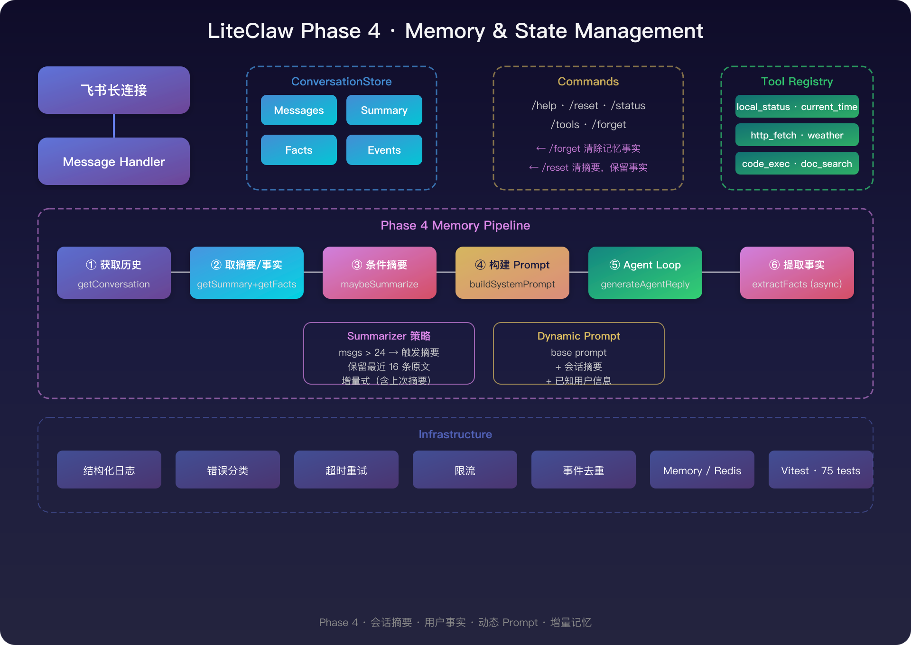

# Phase 4：记忆与状态管理

> 让 Agent 从"对话即忘"升级到"记住重要信息"——短期记忆摘要 + 长期用户事实。

---

## 1. 目标

Phase 3 的会话管理只有滑动窗口（最近 40 条消息），超出窗口的内容直接丢弃。Phase 4 解决两个问题：

1. **上下文丢失**：长对话中早期信息被裁剪，模型失去连贯性
2. **跨会话遗忘**：每次 `/reset` 后一切从零开始，无法积累用户偏好

---

## 2. 架构设计

<p align="center">
  
</p>

在现有 ConversationStore 上新增三层：

| 组件 | 职责 | 触发时机 |
|------|------|---------|
| **Summarizer** | 将旧消息压缩为摘要文本 | 消息数超过阈值时，在 LLM 调用前 |
| **Facts Store** | 存储用户关键事实（姓名、偏好等） | LLM 回复后，后台异步提取 |
| **Prompt Builder** | 将 base prompt + summary + facts 拼装 | 每次 LLM 调用前 |

---

## 3. 数据模型

### ConversationSummary

```typescript
type ConversationSummary = {
  text: string;           // LLM 生成的摘要文本
  summarizedUpTo: number; // 已摘要的消息累计条数
  createdAt: number;      // 时间戳
};
```

### UserFact

```typescript
type UserFact = {
  key: string;     // 英文蛇形命名（name, preferred_language）
  value: string;   // 中文描述
  updatedAt: number;
};
```

---

## 4. 消息处理流程

```
1. getConversation(chatId)           — 获取消息历史
2. getSummary(chatId)                — 获取已有摘要
3. getFacts(chatId)                  — 获取用户事实
4. maybeSummarize(messages, summary) — 超阈值时触发 LLM 摘要
5. buildSystemPrompt(summary, facts) — 动态拼装 system prompt
6. generateAgentReply(conversation, { systemPrompt })
7. appendMessages(chatId, ...)       — 保存消息
8. extractFacts(messages, facts)     — 后台 fire-and-forget
9. 发送回复
```

关键设计：
- **摘要在 LLM 调用前触发**，确保上下文窗口精简
- **事实提取在回复后异步运行**，不增加用户等待时间
- 摘要是**增量式**的：每次摘要包含上一次摘要，信息累积不丢失

---

## 5. Summarizer 策略

| 参数 | 环境变量 | 默认值 | 含义 |
|------|---------|--------|------|
| `summarizeThreshold` | `MEMORY_SUMMARIZE_THRESHOLD` | 24 | 超过此消息数触发摘要 |
| `recentWindow` | `MEMORY_RECENT_WINDOW` | 16 | 保留最近 N 条消息原文 |

当 `messages.length > threshold`：
1. 前 `messages.length - recentWindow` 条 → 发给 LLM 生成摘要
2. 后 `recentWindow` 条 → 保留原文
3. 新摘要存入 store，下次查询时作为 system prompt 前缀

---

## 6. Facts Extractor 策略

| 参数 | 环境变量 | 默认值 | 含义 |
|------|---------|--------|------|
| `factsExtractionEnabled` | `MEMORY_FACTS_ENABLED` | false | 是否启用 |
| `maxFacts` | `MEMORY_MAX_FACTS` | 10 | 每个 chatId 最多保存的事实数 |

- 默认关闭（需额外 LLM 调用）
- 每次只看最近 4 条消息
- LLM 输出 JSON 数组，带容错解析
- `/forget` 命令可手动清除

---

## 7. 存储实现

### MemoryStore
- `summaries: Map<string, ConversationSummary>`
- `facts: Map<string, UserFact[]>`
- `resetConversation` 清 summary，保留 facts

### RedisStore
- Summary: `{prefix}:summary:{chatId}` — JSON string, TTL = sessionTtlSeconds
- Facts: `{prefix}:facts:{chatId}` — Redis Hash, TTL = sessionTtlSeconds × 4（事实存活更久）

---

## 8. 新增命令

| 命令 | 别名 | 作用 |
|------|------|------|
| `/forget` | `/忘记`, `忘记我` | 清除当前会话的用户事实 |

`/reset` 行为更新：同时清除会话摘要（但保留 facts）。

---

## 9. 配置项

```env
# 记忆管理
MEMORY_SUMMARIZE_THRESHOLD=24   # 触发摘要的消息数阈值
MEMORY_RECENT_WINDOW=16         # 保留最近消息原文数
MEMORY_MAX_FACTS=10             # 每 chatId 最大事实数
MEMORY_FACTS_ENABLED=false      # 是否启用事实提取（需额外 LLM 调用）
```

---

## 10. 完成标准

- [x] ConversationStore 支持 summary 和 facts 的 CRUD
- [x] MemoryStore / RedisStore 均已实现
- [x] Summarizer 在消息超阈值时自动触发
- [x] 增量摘要（包含旧摘要），信息不丢失
- [x] Facts Extractor 后台异步运行，不阻塞回复
- [x] Dynamic System Prompt 拼装 base + summary + facts
- [x] `/forget` 命令清除事实，`/reset` 同时清摘要
- [x] 单元测试覆盖 summarizer、facts-extractor、prompt-builder
