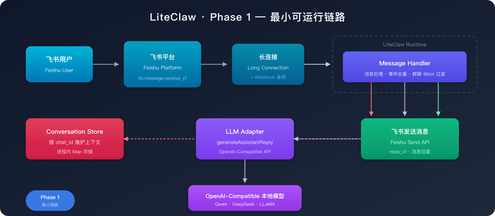
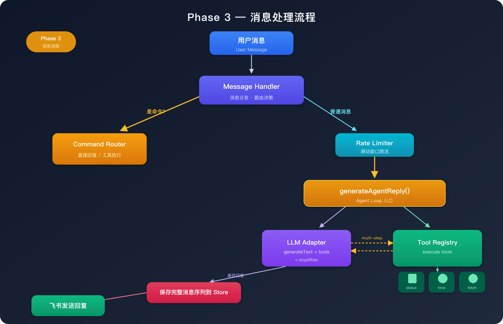
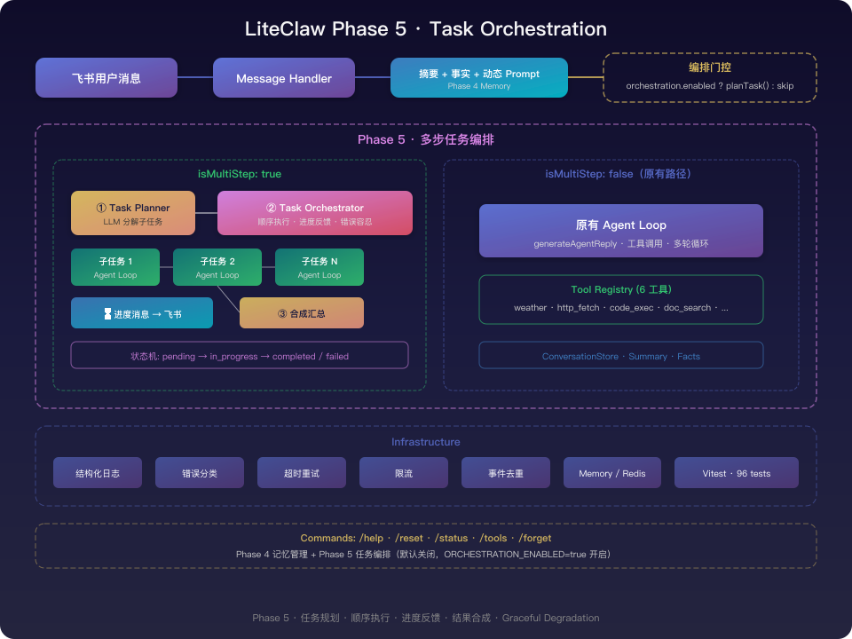

# LiteClaw 阶段实现说明

这份文档不是 roadmap 的重复版本，而是从工程实现视角说明：

- 每个 phase 想解决什么问题
- 当前已经实现了什么
- 关键技术结构是什么
- 后续该如何继续演进

如果你想看阶段顺序和优先级，优先看 [ROADMAP.md](../ROADMAP.md)。
如果你想看"每个阶段到底是怎么落到代码里的"，优先看这份文档。

---

## 1. 当前阶段总览

| Phase | 目标 | 当前状态 | 说明 |
| --- | --- | --- | --- |
| Phase 1 | 打通最小可运行链路 | ✅ 已完成 | 飞书长连接、模型调用、上下文、事件去重已打通 |
| Phase 2 | 补齐 Agent 基础设施 | ✅ 已完成 | Redis、结构化日志、错误分类、命令路由、稳定性治理已落地 |
| Phase 3 | 工具调用（Agent Loop） | ✅ 已完成 | Tool registry + 模型自主选工具 + 多轮 Agent Loop |
| Phase 4 | 记忆与状态管理 | ✅ 已完成 | 会话摘要 + 用户事实 + 动态 Prompt |
| Phase 5 | 任务执行与编排 | ✅ 已完成 | 多步任务编排 + 进度反馈 + 合成汇总 |
| Phase 6 | 向 OpenClaw 能力对齐 | 未开始 | 系统性补齐更完整 Agent 能力 |

---

## 2. Phase 1：最小可运行链路

### 2.1 目标

让用户可以在飞书里给 LiteClaw 发文本消息，并拿到本地模型生成的回复。

### 2.2 已实现内容

- 飞书长连接接入
- webhook 兼容回退入口
- 文本消息解析
- 会话上下文维护
- `event_id` 去重
- 群聊仅在 `@机器人` 时响应
- 基础模型调用
- `GET /healthz`

### 2.3 关键技术结构

<p align="center">
  
</p>

### 2.4 关键模块

- `src/services/feishu.ts`
- `src/services/feishu-message-handler.ts`
- `src/services/llm.ts`
- `src/routes/feishu.ts`

### 2.5 这一阶段的核心价值

先验证"消息真的能进来、模型真的能调用、结果真的能回去"，而不是一开始就做复杂 Agent 编排。

---

## 3. Phase 2：Agent 基础能力

### 3.1 目标

把系统从"能跑的 demo"升级成"可以持续迭代的服务底座"。

### 3.2 当前已实现内容

- Redis 会话持久化
- 可替换 store abstraction
- 结构化 JSON 日志
- 错误分类
- 基础命令路由：`/help`、`/reset`、`/status`、`/tools`
- 模型 / 飞书 / Redis 的超时控制
- 模型有限重试
- 基础限流

### 3.3 Phase 2 总体结构

<p align="center">
  
</p>

### 3.4 Phase 2 里 Redis 是怎么做 store 的

核心思路不是"把业务代码直接改成 Redis 版"，而是先做一层统一接口：

```
Message Handler ──► ConversationStore Interface ──┬──► MemoryStore
                                                   └──► RedisStore
```

这样消息处理逻辑只依赖接口，不关心底层到底是进程内 Map 还是 Redis。

#### 存储接口

统一接口定义在 `src/services/store.ts`，主要方法：

- `getConversation` / `appendExchange` / `appendMessages` / `resetConversation`
- `tryStartEvent` / `markEventDone` / `markEventFailed`

#### MemoryStore

默认实现，适合本地快速启动：进程内 `Map`，重启后丢失。

#### RedisStore

用于跨进程 / 跨重启保留近期会话：Redis list 存储，`LTRIM` 裁剪，`SET NX PX` 去重。

### 3.5 Phase 2 的稳定性层

- **结构化日志**：`src/services/logger.ts`，单行 JSON，固定 event 名
- **错误分类**：`src/services/errors.ts`，带 code / category / retryable
- **超时与重试**：`src/services/resilience.ts`
- **限流**：`src/services/rate-limit.ts`，按 chat_id 滑动窗口

---

## 4. Phase 3：工具调用（Agent Loop）

### 4.1 目标

让 LiteClaw 从"会回复"升级到"会执行受控动作"——Agent 最核心的能力跃迁。

### 4.2 已实现内容

**工具体系：**
- Tool interface 带 Zod parameters schema
- Tool registry + `toAISDKTools()` 桥接层
- 6 个内置工具：`local_status`、`current_time`、`http_fetch`、`weather`、`code_exec`、`feishu_doc_search`
- 工具执行超时保护（`withTimeout`）
- 命令触发工具（`/status`、`/tools`）仍然正常

**Agent Loop：**
- `generateAgentReply()` —— 基于 Vercel AI SDK 的 `stopWhen(stepCountIs(N))` 自动多轮循环
- 模型自主决定是否调用工具、调用哪个
- 工具结果自动回传模型，模型基于结果生成最终回复
- 完整消息序列（含 tool calls + tool results）保存到 conversation store

**消息类型扩展：**
- `ConversationMessage` 联合类型支持 4 种角色
- `appendMessages()` 支持灵活消息序列存储
- MemoryStore / RedisStore 均已适配

### 4.3 Phase 3 总体结构

<p align="center">
  
</p>

### 4.4 关键设计决策

1. **使用 Vercel AI SDK 内置 agent loop**（`stopWhen`）而非手写循环 — 更简洁、更健壮
2. **保留 LiteClaw 自有 tool registry** — `toAISDKTools()` 桥接层负责转换
3. **新增 `appendMessages` 方法** — 支持灵活消息序列存储，兼容 agent loop 产生的多条消息
4. **`http_fetch` 内置域名白名单** — 安全边界，防止 SSRF
5. **条件注册** — `weather`、`code_exec`、`feishu_doc_search` 仅在环境变量配置后才注册，模型不会看到未启用的工具
6. **Vitest 单测** — 8 个测试文件，57 个用例覆盖核心模块（resilience、llm 消息转换、所有工具、registry）

### 4.5 新增工具指南

详见 [Phase 3 技术文档](phase3-tool-calling.md#10-新增工具指南)。

---

## 5. Phase 4：记忆与状态管理 ✅

### 5.1 目标

把"当前会话上下文"升级成更长期、更结构化的记忆体系。

### 5.2 已实现内容

**会话摘要（Summarizer）：**
- 消息数超过阈值（默认 24）时自动触发 LLM 摘要
- 增量式摘要：每次包含上一次摘要，信息累积不丢失
- 摘要注入 system prompt，保持上下文连贯
- 摘要失败不阻塞主流程

**用户事实（Facts Store）：**
- 每个 chatId 维护最多 10 条关键事实
- 后台异步提取，不增加用户等待时间
- 事实跨 `/reset` 保留（长期记忆）
- `/forget` 命令手动清除
- 默认关闭（`MEMORY_FACTS_ENABLED=true` 启用）

**动态 System Prompt：**
- `buildSystemPrompt` 拼装 base + summary + facts
- 替代静态 `config.systemPrompt`

**存储扩展：**
- ConversationStore 新增 summary/facts CRUD 方法
- MemoryStore / RedisStore 均已实现
- Redis facts 使用 Hash 结构，TTL = sessionTtlSeconds × 4

### 5.3 Phase 4 总体结构

<p align="center">
  
</p>

### 5.4 关键设计决策

1. **摘要在 LLM 调用前触发** — 确保上下文窗口精简
2. **事实提取 fire-and-forget** — 不阻塞用户体验
3. **增量摘要** — 避免信息丢失，每次摘要包含前一次
4. **facts 跨会话保留** — `/reset` 清会话和摘要，不清 facts
5. **Vitest 单测** — prompt-builder、summarizer、facts-extractor 全部覆盖

详见 [Phase 4 技术文档](phase4-memory.md)。

---

## 6. Phase 5：多步任务编排 ✅

### 6.1 目标

让 LiteClaw 从"单次回复"升级到"规划 → 分步执行 → 进度反馈 → 汇总回复"。

### 6.2 已实现内容

**任务规划（Task Planner）：**
- LLM 判断用户请求是否需要拆分为多个子任务
- 输出 JSON 格式的子任务列表
- 容错解析，解析失败降级为单步执行

**任务编排（Task Orchestrator）：**
- 顺序执行子任务，每个子任务复用 `generateAgentReply`
- 子任务失败不中断整体流程（Graceful Degradation）
- 所有子任务完成后做一次 LLM 合成调用，生成连贯回复

**进度反馈（Task Progress）：**
- 每个子任务开始执行时发送飞书进度消息
- 格式化输出包含完成状态标记

**集成设计：**
- 编排层位于 Agent Loop 之上，不替换原有流程
- 默认关闭（`ORCHESTRATION_ENABLED=false`）
- 简单请求零额外开销，直接走原有 Agent Loop

### 6.3 Phase 5 总体结构

<p align="center">
  
</p>

### 6.4 关键设计决策

1. **编排层在 Agent Loop 之上** — 不替换，而是包装
2. **默认关闭** — 需要显式启用，零行为变化
3. **Graceful Degradation** — 子任务失败不中断，结果尽可能汇总
4. **进度消息可选** — 通过 `ORCHESTRATION_PROGRESS_ENABLED` 控制
5. **Vitest 单测** — planner、orchestrator、progress 全部覆盖

详见 [Phase 5 技术文档](phase5-task-orchestration.md)。

---

## 7. Phase 6：向 OpenClaw 能力对齐

### 7.1 目标

系统性补齐更完整的 OpenClaw 风格 Agent 能力。

### 7.2 主要方向

- 更完整的 Agent 编排
- 更成熟的工具生态
- 更强的权限与审计
- 更丰富的消息交互形式
- 更成熟的部署和可观测能力

---

## 8. 当前建议

Phase 5 已完成，下一步最自然的方向是：

1. **Phase 6：向 OpenClaw 能力对齐** — 更完整的 Agent 编排能力
2. 扩展更多实用工具和消息交互形式
3. 根据实际使用反馈优化任务编排表现
