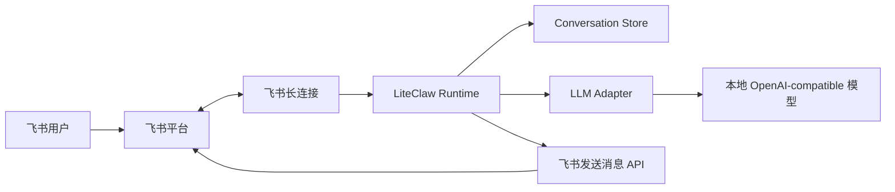
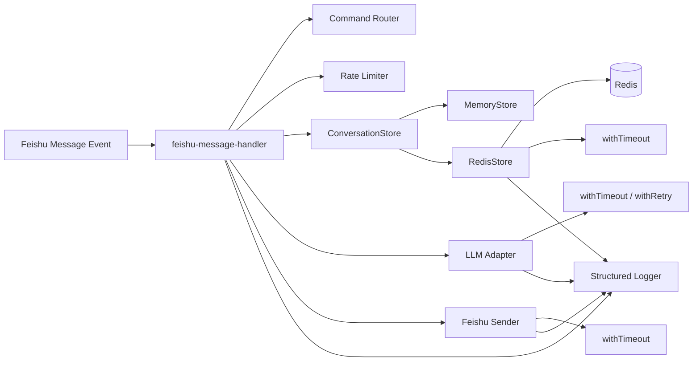
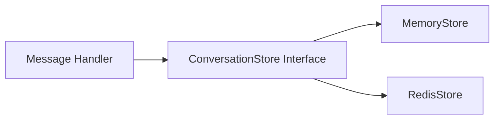
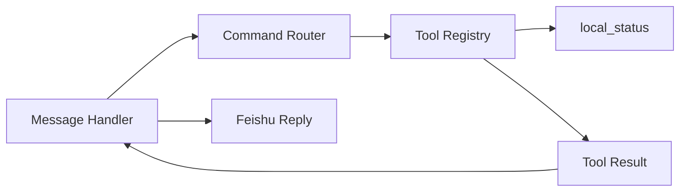
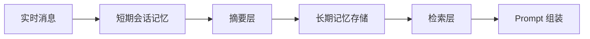
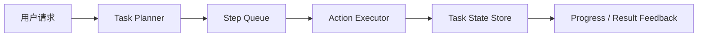

# LiteClaw 阶段实现说明

这份文档不是 roadmap 的重复版本，而是从工程实现视角说明：

- 每个 phase 想解决什么问题
- 当前已经实现了什么
- 关键技术结构是什么
- 后续该如何继续演进

如果你想看阶段顺序和优先级，优先看 [ROADMAP.md](../ROADMAP.md)。  
如果你想看“每个阶段到底是怎么落到代码里的”，优先看这份文档。

---

## 1. 当前阶段总览

| Phase | 目标 | 当前状态 | 说明 |
| --- | --- | --- | --- |
| Phase 1 | 打通最小可运行链路 | 已完成 | 飞书长连接、模型调用、上下文、事件去重已打通 |
| Phase 2 | 补齐 Agent 基础设施 | 核心骨架已完成 | Redis、结构化日志、错误分类、命令路由、稳定性治理已落地 |
| Phase 3 | 工具调用 | 已开始 | 已有 tool registry、`local_status` 和命令触发的工具闭环 |
| Phase 4 | 记忆与状态管理 | 未开始 | 会在工具调用后再深化 |
| Phase 5 | 任务执行与编排 | 未开始 | 从聊天走向 workflow |
| Phase 6 | 向 OpenClaw 能力对齐 | 未开始 | 系统性补齐更完整 Agent 能力 |

---

## 2. Phase 1：最小可运行链路

### 2.1 目标

让用户可以在飞书里给 LiteClaw 发文本消息，并拿到本地模型生成的回复。

### 2.2 已实现内容

- 飞书长连接接入
- webhook 兼容回退入口
- 文本消息解析
- 会话上下文维护
- `event_id` 去重
- 群聊仅在 `@机器人` 时响应
- 基础模型调用
- `GET /healthz`

### 2.3 关键技术结构

### 2.4 关键模块

- `src/services/feishu.ts`
- `src/services/feishu-message-handler.ts`
- `src/services/llm.ts`
- `src/routes/feishu.ts`

### 2.5 这一阶段的核心价值

先验证“消息真的能进来、模型真的能调用、结果真的能回去”，而不是一开始就做复杂 Agent 编排。

---

## 3. Phase 2：Agent 基础能力

### 3.1 目标

把系统从“能跑的 demo”升级成“可以持续迭代的服务底座”。

### 3.2 当前已实现内容

- Redis 会话持久化
- 可替换 store abstraction
- 结构化 JSON 日志
- 错误分类
- 基础命令路由：`/help`、`/reset`、`/status`、`/tools`
- 模型 / 飞书 / Redis 的超时控制
- 模型有限重试
- 基础限流

### 3.3 Phase 2 总体结构

### 3.4 Phase 2 里 Redis 是怎么做 store 的

核心思路不是“把业务代码直接改成 Redis 版”，而是先做一层统一接口：

这样消息处理逻辑只依赖接口，不关心底层到底是：

- 进程内 `Map`
- Redis
- 还是以后换成别的数据库

#### 存储接口

统一接口定义在：

- `src/services/store.ts`

主要方法包括：

- `getConversation`
- `appendExchange`
- `resetConversation`
- `tryStartEvent`
- `markEventDone`
- `markEventFailed`

#### MemoryStore

默认实现，适合本地快速启动：

- 进程内 `Map`
- 重启后丢失上下文

代码位置：

- `src/services/memory.ts`

#### RedisStore

用于跨进程 / 跨重启保留近期会话：

- 会话消息按 Redis list 存
- 通过 `LTRIM` 保留最近若干条消息
- 会话 key 设置 `SESSION_TTL_SECONDS`
- 去重事件通过 `SET NX PX` 实现

代码位置：

- `src/services/redis-store.ts`

#### 后端选择层

真正决定使用 `memory` 还是 `redis` 的地方在：

- `src/services/conversation-store.ts`

它会根据 `.env.local` 里的：

- `STORAGE_BACKEND=memory`
- `STORAGE_BACKEND=redis`

来决定实际启用哪种 store。

### 3.5 Phase 2 的稳定性层是怎么接入的

#### 结构化日志

统一日志模块：

- `src/services/logger.ts`

特点：

- 单行 JSON
- 固定 `event` 名
- 方便后续接日志平台或做过滤

#### 错误分类

统一错误类型：

- `src/services/errors.ts`

错误会带上：

- `code`
- `category`
- `retryable`

这样后续可以更明确地区分：

- 模型错误
- 飞书错误
- Redis 错误
- 配置错误

#### 超时与重试

统一稳定性工具：

- `src/services/resilience.ts`

当前策略：

- 模型调用：超时 + 有限重试
- 飞书发消息：超时，不自动重试
- Redis 操作：超时

#### 限流

基础限流模块：

- `src/services/rate-limit.ts`

当前是：

- 按 `chat_id` 做滑动窗口限流
- 命令优先于限流执行
- 普通消息进入模型前才检查限流

### 3.6 Phase 2 还剩什么

现在剩下的主要是优化项，不再是缺主干：

- 更细的限流策略
- 更细的 trace / 耗时统计
- 更丰富的命令路由
- 更精细的错误反馈

---

## 4. Phase 3：工具调用

### 4.1 目标

让 LiteClaw 从“会回复”升级到“会执行受控动作”。

### 4.2 当前已实现内容

- Tool interface
- Tool registry
- 首个内置工具 `local_status`
- 命令触发的工具执行：`/status`
- 工具列表查看：`/tools`
- 工具调用日志与失败兜底

### 4.3 当前结构

### 4.4 当前这一步为什么先做 local_status

- 依赖少
- 易验证
- 不需要额外外部服务
- 可以直接复用 `/healthz` 所依赖的运行状态快照

### 4.5 下一步建议

在当前结构上，最自然的延伸是：

- 增加 `doc_search`
- 增加受控的 `http_fetch`
- 再把“命令触发工具”扩展为“模型自主选择工具”

---

## 5. Phase 4：记忆与状态管理

### 5.1 目标

把“当前会话上下文”升级成更长期、更结构化的记忆体系。

### 5.2 计划实现内容

- 短期记忆 / 长期记忆分层
- 用户级与会话级状态
- 摘要机制
- 记忆裁剪与回收

### 5.3 关键结构方向

---

## 6. Phase 5：任务执行与编排

### 6.1 目标

让 LiteClaw 能处理多步任务，而不只是单轮对话。

### 6.2 计划实现内容

- 任务拆解
- 中间状态保存
- 任务恢复
- 执行状态机
- 进度反馈

### 6.3 关键结构方向

---

## 7. Phase 6：向 OpenClaw 能力对齐

### 7.1 目标

系统性补齐更完整的 OpenClaw 风格 Agent 能力。

### 7.2 主要方向

- 更完整的 Agent 编排
- 更成熟的工具生态
- 更强的权限与审计
- 更丰富的消息交互形式
- 更成熟的部署和可观测能力

---

## 8. 当前建议

从当前状态看，最合适的下一步是：

1. 在 Phase 3 上继续扩展第二个工具
2. 优先选 `doc_search` 或受控 `http_fetch`
3. 再进入模型自主选工具

这样收益最高，也最符合现在这套代码结构的演进方向。
